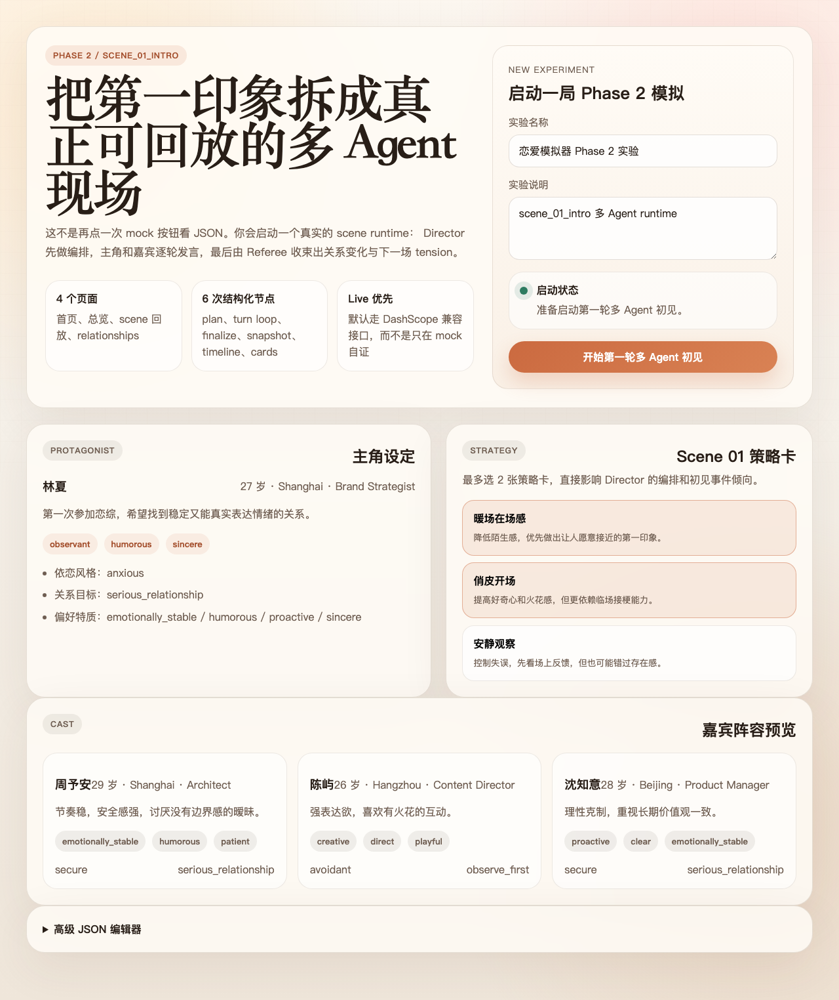
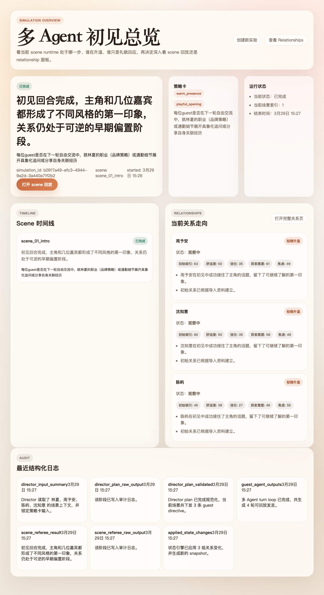
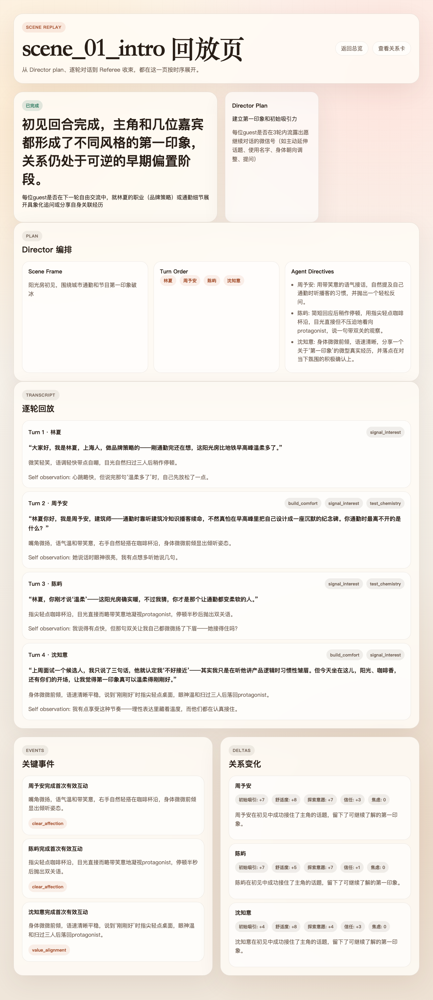
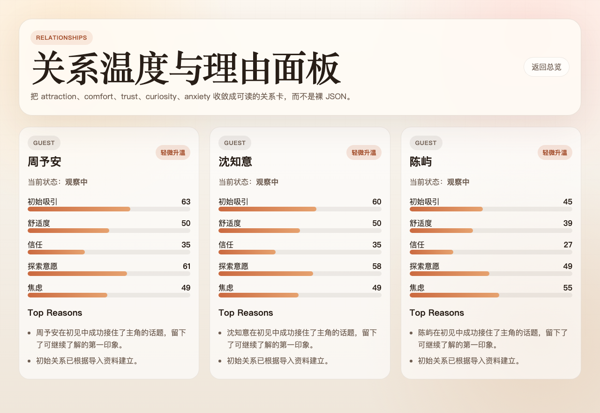
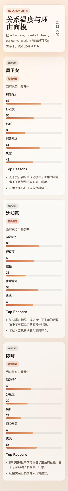

# 恋爱模拟器 Phase 2

一个基于 FastAPI + Redis Worker + Next.js 的多 Agent 恋爱模拟器原型。

当前交付重点不是“单次 Director 出结果”，而是把 `scene_01_intro` 做成真实可回放的多 Agent runtime：

1. Director 先产出场景编排
2. 主角与嘉宾按 turn loop 逐轮发言
3. Referee 做结构化收束
4. 关系变化、snapshot、audit logs 落库
5. 前端提供首页、simulation 总览、scene 回放、relationships 四个页面

## Features

- `scene_01_intro` 的真实多 Agent runtime
- DashScope 百炼兼容 live 调用，支持 `DIRECTOR_PROVIDER_MODE=auto`
- schema drift 归一化与 fallback 处理
- `scene_messages` / `agent_turns` / `scene_artifacts` 持久化
- simulation overview / timeline / scene replay / relationships API
- 可直接运行的产品化前端，而不是 JSON 调试面板
- Docker Compose 一键启动

## Tech Stack

- Backend: FastAPI, SQLAlchemy, Alembic, Redis Worker, PostgreSQL
- Frontend: Next.js App Router
- LLM Provider: DashScope-compatible OpenAI API
- Infra: Docker Compose

## Repository Layout

```text
backend/                  FastAPI API, worker, runtime, models, migrations
frontend/                 Next.js 页面与前端 API 客户端
docs/screenshots/         运行页面截图
PHASE1_IMPLEMENTATION.md  Phase 1 实现说明
PHASE2_PLAN.md            Phase 2 范围、接口、验收标准
BACKEND_ARCHITECTURE.md   后端架构说明
SCENE_DESIGN.md           场景设计
STATE_UPDATE_RULES.md     状态更新规则
Soul.md                   角色灵魂设定
API_Test.py               DashScope 兼容调用参考
```

## Quick Start

### 1. 配置环境变量

复制示例环境变量并填入 DashScope API Key：

```bash
cp .env.example .env
```

`.env` 示例：

```env
DASHSCOPE_API_KEY=your_key_here
DIRECTOR_PROVIDER_MODE=auto
```

说明：

- `DIRECTOR_PROVIDER_MODE=auto` 时，有 `DASHSCOPE_API_KEY` 就走 live；没有则退回 mock。
- 当前默认前端访问后端地址为 `http://localhost:8000/api`。

### 2. 一键启动

推荐直接使用仓库内脚本：

```bash
./run.sh
```

它等价于：

```bash
docker compose -p love-simulator up --build -d
```

### 3. 打开页面

- 前端首页: `http://localhost:3000`
- 后端健康检查: `http://localhost:8000/health`
- OpenAPI: `http://localhost:8000/docs`

### 4. 停止服务

```bash
./stop.sh
```

## How To Run A Simulation

1. 打开首页 `http://localhost:3000`
2. 使用默认主角和嘉宾配置，或展开高级 JSON 编辑器替换人物
3. 选择 1-2 张策略卡
4. 点击“开始第一轮多 Agent 初见”
5. 页面会跳转到 `/simulations/{id}` 总览页
6. 等待 worker 完成 `scene_01_intro`
7. 从总览页进入 scene 回放页和 relationships 页

## Main Pages

- 首页: `/`
- simulation 总览页: `/simulations/{id}`
- scene 回放页: `/simulations/{id}/scenes/{sceneRunId}`
- relationships 页: `/simulations/{id}/relationships`

## API Summary

保留接口：

- `POST /api/projects`
- `POST /api/projects/{project_id}/guests/import`
- `GET /api/projects/{project_id}`
- `POST /api/projects/{project_id}/simulations`
- `GET /api/simulations/{simulation_id}`

Phase 2 新增/升级：

- `GET /api/simulations/{simulation_id}`: simulation overview DTO
- `GET /api/simulations/{simulation_id}/scenes/{scene_run_id}`: scene replay DTO
- `GET /api/simulations/{simulation_id}/timeline`
- `GET /api/simulations/{simulation_id}/relationships`

## Runtime Flow

`scene_01_intro` 的执行链路：

```text
worker
  ->
director_plan
  ->
agent_turn_loop
  ->
scene_referee / director_finalize
  ->
state apply
  ->
scene replay dto
```

关键持久化对象：

- `scene_messages`
- `agent_turns`
- `scene_artifacts`
- `audit_logs`
- `state_snapshots`

## Screenshots

### 首页



### Simulation 总览页



### Scene 回放页



### Relationships 页



### Relationships 移动端



## Current Scope

当前已完成：

- 修复前端生产容器 `_next/static` 404
- 修复 hydration / loading 卡死相关链路
- 实现 `scene_01_intro` 多 Agent runtime
- 实现 scene replay / timeline / relationships DTO
- 实现首页、总览页、scene 回放页、relationships 页
- 完成浏览器级验证与 live 运行验证

当前未做：

- 全部 9 个场景升级
- 实验分支系统
- 最终完整报告页
- 多用户系统
- token 级流式打字效果

## Notes

- 仓库已忽略 `.env`、`postgres_data/`、`frontend/.next/`、`frontend/node_modules/`，适合直接推送代码。
- 如果直接运行裸 `docker compose up` 遇到 `project name must not be empty`，请改用 `./run.sh` 或显式加 `-p love-simulator`。
